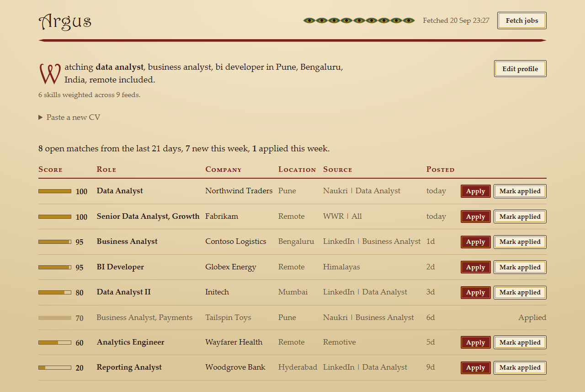
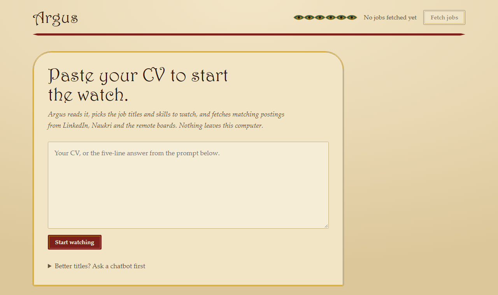
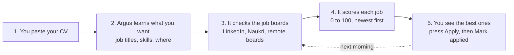

# Argus

**Paste your CV. Argus watches the job boards for you.**

It reads the CV, picks the job titles and skills to watch, fetches matching postings from LinkedIn, Naukri and the remote boards, scores every match, and shows the best ones on a page that runs on your own computer. No account, no API key, nothing leaves your machine.

<picture>
  <source media="(prefers-color-scheme: dark)" srcset="docs/img/dashboard-dark.png">
  
</picture>

<sub>Sample data. The nine peacock eyes in the masthead are the nine feeds being watched; they blink while a fetch runs.</sub>

Named for Argus Panoptes, the hundred-eyed watchman who never fully slept.

## Why Argus

- **Private by design.** Your CV is parsed on your computer and written to one local file. There is no server, no telemetry and no sign-up.
- **Nothing to configure.** Paste the CV, press one button. Titles, skills, country and cities are picked for you and can be edited later in a small form.
- **One dependency.** Python's standard library plus `feedparser`. The page is one HTML file, the server is `http.server`, the store is a CSV.
- **Runs without you.** Optionally, the same code runs each morning in GitHub Actions and posts the ranked table to an issue in a private repo, so you read it on your phone.

## Quick start

### Windows

1. **Install Python 3.11 or newer** from [python.org](https://www.python.org/downloads/). Tick *Add python.exe to PATH*.
2. **Download this repo** (Code → Download ZIP) and unzip it.
3. **Double-click `Argus.bat`.** The first run creates a virtual environment and installs `feedparser`. A browser tab opens.
4. **Paste your CV** into the box and press **Start watching**.

The page refreshes itself when the first batch of jobs is in. Every later double-click on `Argus.bat` fetches again and opens the page.

### macOS and Linux

```sh
python3 -m venv .venv
.venv/bin/pip install -r requirements.txt
.venv/bin/python argus/dashboard.py  # opens http://localhost:8765/
```



**Better titles.** A CV rarely states the job titles you want next. Open *Better titles? Ask a chatbot first* on the page, copy the prompt, paste it with your CV into ChatGPT, Claude or Gemini, and paste the five-line answer into the box instead of the CV. Argus reads both shapes. **Edit profile** changes any answer later.

## How it works



Every match from the last 21 days is scored. Freshness dominates, because applying in the first day matters more than a perfect keyword match.

| Signal | Points |
| --- | --- |
| Posted within 1 day | 50 |
| Posted within 3 days | 40 |
| Posted within 7 days | 25 |
| Posted within 14 days | 10 |
| First matching job title, most wanted first | set in `config.toml` |
| First matching location | set in `config.toml` |
| Each skill found in the posting | 5, capped at 25 |

The total is capped at 100, so a score is a percentage of the best possible match.

On the page, **Apply** opens the posting and **Mark applied** records it and greys the row. Applied jobs leave the digest. **Fetch jobs** runs a new fetch in the background.

## Tune by hand

Press **Edit profile** on the page, or edit `config.toml`. It is the only file you touch:

- `role_keywords` — a job is kept when its title or description contains one
- `seniority_block` — a job is dropped when its title contains one
- `[[discovery.feeds]]` — any RSS feed. The parser reads the company from the title for `weworkremotely.com`, `linkedin.com` and `naukri.com` URLs. Other feeds use the plain title.
- `[scoring]` — the weights in the table above

## Command line

```bat
.venv\Scripts\python.exe argus\dashboard.py          # serve at localhost:8765
.venv\Scripts\python.exe argus\discover.py --days 7  # fetch without the page
.venv\Scripts\python.exe argus\discover.py --check   # feed health, no writes
.venv\Scripts\python.exe tests\tests.py            # the test suite
```

## Optional: run it on GitHub instead

Argus can run every morning in GitHub Actions and post the ranked table to an issue in your own repo. No computer needs to be switched on.

1. **[Use this template](../../generate)** → create a **private** repo.
2. **Actions → Set up profile → Run workflow.** Type the five answers. The chatbot prompt in [docs/profile-prompt.md](docs/profile-prompt.md) produces them.
3. Open the pinned **Job digest** issue. It fills in a few minutes and updates every morning.

If GitHub asks you to enable workflows on the new repo, click **Enable**. To keep the local page and the Action in step, `git pull` before you double-click `Argus.bat`.

**Updating.** Once: `git remote add upstream https://github.com/SAMEER-MOHAPATRA/Argus`. Then `git pull upstream master`. Conflicts stay inside `config.toml`.

## Contributing

Argus is small on purpose: seven Python files and one HTML file in `argus/`, one test file in `tests/`. That makes it easy to read in an evening and easy to change.

Good first contributions:

- **A job board you use.** Any site with an RSS feed is one `[[discovery.feeds]]` entry. If its titles need a new company-parsing rule, say so in the issue.
- **CV extraction for your field or country.** `cv.py` matches titles, skills, countries and cities against small dictionaries. Add the words that describe your market.
- **A launcher for macOS or Linux.** `Argus.bat` does three things: make the venv, install one package, start the page. A shell script that does the same is welcome.
- **A bug you hit.** Open an issue with the feed URL or the pasted text that broke.

Before you open a pull request, run the tests:

```sh
.venv/bin/python tests/tests.py       # prints "OK: tests passed"
```

Issues are triaged with the labels `needs-triage`, `needs-info`, `ready-for-agent`, `ready-for-human` and `wontfix`. Design decisions are recorded in `CONTEXT.md`, [docs/adr/](docs/adr/) and [docs/explained/](docs/explained/). Read those before a larger change, so your change fits the ones already made.

If Argus found you an interview, or saved you an evening of tab-switching, a star helps other job hunters find it.

## License

[MIT](LICENSE). Use it, change it, ship it.
